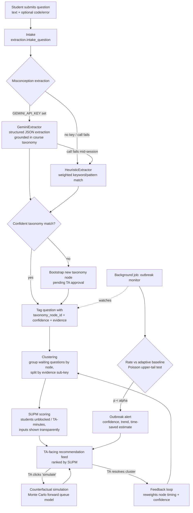

# QueueMerge — Architecture & Data Model

## Pipeline



## Data model

| Table | Purpose | Key columns |
|---|---|---|
| `courses` | one row per course/session context | `id`, `name` |
| `taxonomy_nodes` | course-scoped, hierarchical-ready misconception taxonomy | `course_id`, `name`, `description`, `keywords` (JSON), `is_bootstrapped`, `approved`, `mean_explain_minutes` (EWMA), `confidence_weight` (reweighted by feedback) |
| `students` | one row per student per course | `course_id`, `name` |
| `questions` | raw intake + extraction result | `student_id`, `raw_text`, `code_snippet`, `error_message`, `taxonomy_node_id`, `extraction_confidence`, `evidence_json`, `cluster_id`, `status` |
| `clusters` | dynamic groupings, rebuilt on each refresh | `taxonomy_node_id`, `sub_key`, `explanation`, `status` (active/resolved/merged/superseded) |
| `cluster_members` | membership history (rows kept even after superseding, for audit) | `cluster_id`, `question_id`, `joined_at`, `left_at` |
| `ta_sessions` / `ta_actions` | who did what, when | `action_type`, `cluster_id`, `minutes_spent` |
| `outcomes` | resolved / still_stuck / escalated per question | `question_id`, `label` |
| `outbreak_alerts` | fired alerts with full statistical context | `taxonomy_node_id`, `confidence`, `trend`, `observed_rate`, `baseline_rate`, `estimated_minutes_saved` |
| `feedback_events` | TA labels that drive the feedback loop | `cluster_id`, `ta_label` (resolved/partially_resolved/misclustered), `minutes_spent` |

Full schema (with constraints) lives in `queuemerge/db.py`.

## Module map

```
queuemerge/
  db.py           SQLite schema + connection helper
  taxonomy.py     seed taxonomy, live bootstrap, node CRUD
  llm_client.py   GeminiExtractor (primary) + HeuristicExtractor (fallback)
  extraction.py   intake -> extraction stage, Gemini->heuristic fallback chain
  clustering.py   rebuild_clusters(): group by node, split by evidence sub-key
  supm.py         SUPM scoring, transparent inputs, tie-break logic
  simulation.py   Monte Carlo counterfactual forward simulation
  outbreak.py     Poisson baseline-rate outbreak monitor (background job)
  feedback.py     TA labels -> reweight node timing/confidence
  pipeline.py     QueueMerge orchestrator (single entry point for UI + eval)
  synthetic.py    synthetic queue-log generator with ground-truth labels
  evaluate.py     evaluation harness (deliverable 3), run: python -m queuemerge.evaluate
ui_streamlit.py   TA-facing UI, run: streamlit run ui_streamlit.py
tests/smoke_test.py   end-to-end integration smoke tests, no API key needed
```

## Why Gemini-primary / heuristic-fallback

`llm_client.py` exposes two extractors behind the same interface. `extraction.py`
tries Gemini first (if `GEMINI_API_KEY` is set), and on *any* exception — missing
key, network failure, rate limit, malformed JSON — falls back to the heuristic
extractor for that individual question, not just at startup. This means a
mid-session Gemini outage degrades quality (heuristic matching is weaker on
confusable pairs, see the eval report) but never breaks the pipeline.

## Why clustering rebuilds from scratch each call

`rebuild_clusters()` only touches `status = 'waiting'` questions and always
retires the previous active clusters (moving them to `status='superseded'`)
before rebuilding. This trades a little redundant computation for avoiding an
entire class of stale-membership bugs (e.g. a resolved question still showing
up in a stale cluster). Membership history is preserved in `cluster_members`
regardless.


## Added component: Explanation Memory

`explanation_notes` stores reusable teaching notes keyed by `(course_id, taxonomy_node_id)`.
Each row also records the source cluster for provenance and a transparent `upvotes` count.
Because retrieval is by taxonomy node rather than current cluster ID, notes survive queue
rebuilds and can be reused by later clusters for the same misconception.

Flow: `active cluster -> taxonomy_node_id -> ranked explanation_notes -> TA UI`.
New notes and usefulness votes write back through `queuemerge/memory.py`.
